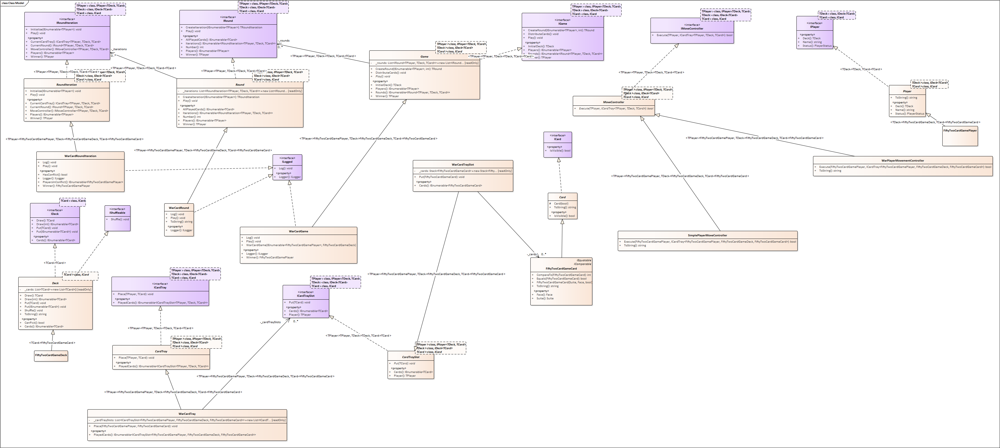

# Disclaimer
After checking the problem statement there criteria seemed to be the highest priority:

* Modeling
* Variable names
* Maintainability

After verifying the given link: https://www.momes.net/jeux/jeux-interieur/regle-des-jeux-de-cartes/la-bataille-regles-du-jeu-842140

I noticed that there are variants for the game, so from that i decided to make it easily modifyable by increasing abstraction.

I focused on making the system as abstract for the ease of maintenainability as possible by maintaining a minimum of documentation.

# Proposition and To Do
* Wrap the code in ``#region...#endregion``.
* More Unit Tests and Integration Tests.
* Exception handling.
* Abstract the game manager make it easily substitutable.
* Make string values a const, use a constants class.

# Explaining Libraries
The project is composed of 2 libraries:
* CardGames.Core: contains the abstractions for any card game that is based on rounds and putting cards on a tray.
* CardGames.War: The specific implementation of this problem.

# Explaining components and extension points
Every component of the game is customizable, this is achieved using the D.I.P and generics, the behavior of each component
is substitutable and can be overriden easily.

Theoretically i designed it to make sure that this is possible, but unfortunately due to the tight time, i couldn't test it on other card games.

## Customize the cards
You can change the card representation and their meaning by only creating a card class that inherit from the ``Card`` class, and override the ``IEquatable<T>`` and ``IComparable<T>``.

## Customize the player move logic
As you can see there is an example of that in the war card game, when the user turn comes, a MoveController subclass will be callled to handle the player behavior logic.
An example of that is ``SimplePlayerMoveController``.

## Customize the Round and Round iteration behavior
Just inherit the ``Round`` or ``RoundIteration`` classes depending on what you want to override, and override the Play method as it contains all the logic related to it.

In case you overide the | ``RoundIteration``, the ``CreateIteration`` method has the ability to use your custom iteration behavior type.

In case you overide the ``Round``, the ``CreateRound`` method has the ability to use your custom ``Round`` behavior type.

## Customize the Game, Deck and Player
These are can be easily customized by inheriting the base class and overriding its method.

These classes rarely change as they are part of every card game and contain the minimum set of operation that are common between all games, The exception can apply to the ``Game`` class which is the highest level class and is the easiest one to override due to the fact that no other internal class depends on it.

# Ease of mocking
All components use interfaces, therefore mocking is easy to use for testing.

# Used Principles
* Don't Repeat Yourself (DRY)
* S.O.L.I.D
* OOP Principles

# Implementation Time
03/10/2020: 

* 15h40-15h50: Problem Analysis Part I, Reading the provided link and defining extension points of the system.
* 15h50-16h20: Problem Analysis Part II  / Coding & Iterating on the design Part 1
* 16h20-16h51: Pause
* 16h51-19h01: Coding & Iterating on the design Part 2 / Implementation & Test Complete (1 Scenario)
* 19h01-19h10: Some documentation of the solution / Code Cleanup & Refactoring
* 19h40-20h20: Implement the history printer
* 20h21-2035: Document the project Part I
* 20h35-20h42: Pause
* 20h42-21h00: Documentation
* 21h00-21h30: Console app methods and reading input
* 21h30-22h00: Explaining the system in README

Time Taken To Design & Implement: ~4h10 the solution

Time Taken To Document / Refactor / Cleanup Code: 50 minutes

Time Taken To Debug / Test / Write tests / Verify the code / Apply fixes: 60 minutes

Total Time Taken Without : ~6h

## Delay Considerations
Some distractions during the implementation due to phone calls and family matters, can be estimated to 30 minutes.

# Class diagram

# Environment 
The solution was implemented using:

* .NET Core
* Visual Studio 2019
* Resharper Ultimate

# Testing the project
Import the library ``CardGames.War`` and perform your tests. You can check an example test for the ``CardGames.War`` in the ``CardGames.War.Tests``

# Unit Tests
Were not implemented due to the lack of time.

